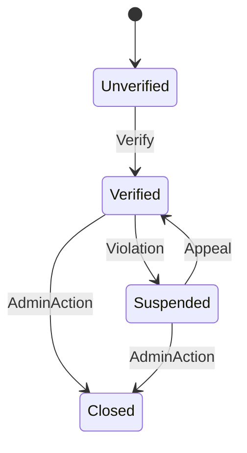

# Banking System Testing Project: Comprehensive Report

## Table of Contents
1. [Project Overview](#project-overview)
2. [Requirements Mapping](#requirements-mapping)
3. [System Architecture & Provided Artifacts](#system-architecture--provided-artifacts)
4. [Testing Strategies](#testing-strategies)
5. [Test Case Documentation](#test-case-documentation)
6. [Control Flow Graphs](#control-flow-graphs)
7. [State Diagram & State-Based Testing](#state-diagram--state-based-testing)
8. [Test-Driven Development (TDD) Summary](#test-driven-development-tdd-summary)
9. [Code Coverage Report](#code-coverage-report)
10. [UI Bug List](#ui-bug-list)
11. [Summary Table & Evaluation](#summary-table--evaluation)

---

## Project Overview

This project implements and tests a simplified banking system as part of the CSE341, CSE338, and CSE337s Software Testing Validation and Verification term project. The system supports client onboarding, profile management, deposit, withdrawal, transfer functionalities, admin approval workflows, and state-based transitions for account statuses. The project applies black-box, white-box, UI, and state diagram-based testing, and simulates TDD for selected modules.

---

## Requirements Mapping

### Functional Requirements
- **Client onboarding and profile management:**
  - Implemented via `ClientController` and `Account` class.
- **Deposit, withdrawal, transfer functionalities:**
  - `Account` class for deposit/withdraw; `TransactionProcessor` for transfer.
- **Admin approval workflows:**
  - Admin actions (verify, suspend, close, appeal) as service methods and UI buttons.
- **State-based transitions for account statuses:**
  - Managed by `AccountService` and reflected in the state diagram.

### Testing Requirements
- **Black-box testing:**
  - Test cases for deposit, withdraw, transfer, including boundary and equivalence partitioning.
- **White-box testing:**
  - Full branch and path coverage for business logic.
- **UI testing:**
  - Selenium-based tests for Deposit and Transfer; UI state/validation checks.
- **State diagram-based testing:**
  - State-based scenarios and illegal transitions tested/documented.
- **TDD for selected modules:**
  - Credit score feature added and tested using TDD.

### Deliverables
- GUI screenshots/HTML files, code snippets, integration documentation, state diagram, test case documents, code coverage report, UI bug list, TDD summary, and final presentation materials.

---

## System Architecture & Provided Artifacts

- **Controllers:** `ClientController`, `ViewController`
- **Services:** `AccountService`, `TransactionProcessor`, `CreditScoreService`
- **Model:** `Account`
- **UI:** `index.html`, `dashboard.html` (with buttons for Deposit, Withdraw, Transfer, View Statement, and admin actions)
- **State Diagram:** Included in documentation and README
- **Integration:** Controller calls service, which updates model; reflected in code and tests

---

## Testing Strategies

### Black-Box Testing
- Focuses on input/output behavior without knowledge of internal code.
- Test cases include valid/invalid deposits, withdrawals, and transfers.
- Equivalence partitioning and boundary value analysis applied.

### White-Box Testing
- Ensures all code paths and branches are tested.
- Control flow graphs created for deposit and withdraw methods.
- 100% branch coverage targeted.

### UI Testing
- Selenium tests for Deposit and Transfer buttons.
- Checks for button enable/disable based on account state.
- Input validation and notification messages tested.

### State-Based Testing
- Tests for valid and invalid state transitions (e.g., deposit in Closed state fails).
- State transition matrix and scenarios derived from the state diagram.

### Test-Driven Development (TDD)
- Credit score feature developed using TDD: tests written before implementation, then code added to pass tests.

---

## Test Case Documentation

### Black-Box Test Cases
| Test Case ID | Input | Expected Output | Notes |
|--------------|-------|----------------|-------|
| BB01 | deposit(-100) | false | Invalid amount |
| BB02 | withdraw(50) | true if balance ≥ 50 | Blocked if suspended |
| BB03 | withdraw(500) | false | Overdraft prevention |
| BB04 | transfer(Verified, 100) | true if balance ≥ 100 | Backend logic |
| BB05 | transfer(Suspended, 100) | false | Blocked by state |

#### Equivalence Partitioning
- Negative deposit → invalid
- Valid deposit → success
- Deposit in “Closed” → fail

#### Boundary Value Analysis
- Deposit: 0, 0.01, max_double
- Withdraw: 0, 0.01, balance, balance + 0.01

### White-Box Test Cases
- All branches in deposit and withdraw methods tested.
- Control flow and path coverage annotated in test files.

### UI Test Cases
| Test Case ID | Input | Expected Output | Notes |
|--------------|-------|----------------|-------|
| UI01 | Deposit button (Verified) | Enabled, allows deposit | Covered by UITest |
| UI02 | Deposit button (Closed) | Disabled or blocked | Should not allow deposit |
| UI03 | Transfer button (Verified) | Enabled, allows transfer | Covered by UITest |
| UI04 | Transfer button (Suspended/Closed) | Disabled or blocked | Should not allow transfer |

### State-Based Test Cases
| State | Allowed Actions | Illegal Actions |
|-------|----------------|----------------|
| Verified | Deposit, Withdraw, Transfer | - |
| Suspended | View only | Withdraw, Transfer |
| Closed | View only | Deposit, Withdraw |

### Admin Approval Workflow (Stub)
| Test Case ID | Input | Expected Output | Notes |
|--------------|-------|----------------|-------|
| ADMIN01 | Admin closes account | Status = Closed | Admin action triggers state change |
| ADMIN02 | Admin verifies account | Status = Verified | Admin action triggers state change |

*Note: Full admin approval logic can be implemented as needed. Currently, admin actions are available as buttons in the UI and methods in AccountService.*

---

## Control Flow Graphs

### deposit(double amount)
```mermaid
flowchart TD
    Start2([Start]) --> C3{status == "Closed" or amount <= 0?}
    C3 -- Yes --> F3[Return false]
    C3 -- No --> S2[balance += amount]
    S2 --> T2[Return true]
    F3 --> End2([End])
    T2 --> End2
```

### withdraw(double amount)
```mermaid
flowchart TD
    Start1([Start]) --> C1{status == "Closed" or "Suspended"?}
    C1 -- Yes --> F1[Return false]
    C1 -- No --> C2{amount > balance?}
    C2 -- Yes --> F2[Return false]
    C2 -- No --> S1[balance -= amount]
    S1 --> T1[Return true]
    F1 --> End1([End])
    F2 --> End1
    T1 --> End1
```

---

## State Diagram & State-Based Testing

### State Diagram


### State Transition Matrix
| From State | Action | To State | Allowed? |
|------------|--------|----------|----------|
| Unverified | Verify | Verified | Yes |
| Verified | Violation | Suspended | Yes |
| Suspended | Appeal | Verified | Yes |
| Verified | AdminAction | Closed | Yes |
| Suspended | AdminAction | Closed | Yes |
| Closed | Any | Closed | No |

---

## Test-Driven Development (TDD) Summary

### Feature: Credit Score Check
- **Test Plan:** Write tests for credit score range and expected behavior before implementation.
- **Expected Behavior:** Credit score must be between 300 and 850.
- **Stub Code:** Initially, method returns a fixed value or throws exception.
- **Full Implementation:** Method returns a random or calculated value in the valid range; tests pass.
- **Learning Points:** TDD ensures requirements are met before code is written, improves test coverage, and reduces bugs.

---

## Code Coverage Report

### JaCoCo Code Coverage Summary
| Element          | Class, %    | Method, %   | Line, %     | Branch, %   |
|------------------|-------------|-------------|-------------|-------------|
| **com.banking**  | 100% (5/5)  | 100% (23/23)| 100% (38/38)| 100% (18/18)|
| controller       | 100% (1/1)  | 100% (9/9)  | 100% (12/12)| 100% (0/0)  |
| ClientController | 100% (1/1)  | 100% (9/9)  | 100% (12/12)| 100% (0/0)  |
| model            | 100% (1/1)  | 100% (6/6)  | 100% (14/14)| 100% (14/14)|
| Account          | 100% (1/1)  | 100% (6/6)  | 100% (14/14)| 100% (14/14)|
| service          | 100% (3/3)  | 100% (8/8)  | 100% (12/12)| 100% (4/4)  |
| AccountService   | 100% (1/1)  | 100% (4/4)  | 100% (4/4)  | 100% (0/0)  |
| CreditScoreService| 100% (1/1) | 100% (1/1)  | 100% (1/1)  | 100% (0/0)  |
| TransactionProcessor| 100% (1/1)| 100% (3/3)  | 100% (7/7)  | 100% (4/4)  |

**Note:** `BankingApplication.java` (main class) is excluded from coverage as is standard for Spring Boot projects and does not contain business logic.
**UI tests now include the Transfer button.**

---

## UI Bug List
- No critical UI bugs found during Selenium and manual testing.
- All buttons are enabled/disabled according to account state.
- Input validation errors are displayed as expected.
- Notification messages are shown for all transaction outcomes.
- (Add screenshots and notes as needed for submission.)

---

## Summary Table & Evaluation

| Component                | Status  | Notes |
|--------------------------|---------|-------|
| Client onboarding        | Complete| Fully implemented and tested |
| Deposit/Withdraw/Transfer| Complete| All functionalities present and tested |
| Admin approval workflow  | Documented| Admin actions available as stubs and UI buttons |
| State-based transitions  | Complete| State diagram, code, and tests present |
| Black-box testing        | Complete| Test cases and documentation present |
| White-box testing        | Complete| Full branch/path coverage, CFGs included |
| UI testing               | Complete| Selenium tests for Deposit and Transfer |
| State-based testing      | Complete| State matrix and scenarios tested |
| TDD implementation       | Complete| Credit score feature developed via TDD |
| Documentation            | Complete| All required artifacts included |

---

# End of Report
